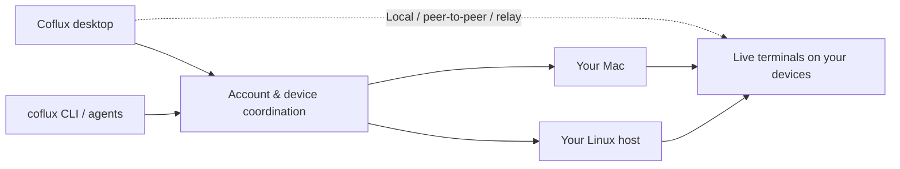

<div align="center">
  
  <h1>Coflux</h1>
  <p><strong>Your terminals. Every machine. One workspace.</strong></p>
  <p>A terminal workspace for you and your coding agents.<br>Run locally, reach your other devices, and take over whenever you need to.</p>
  <p>
    <a href="https://github.com/myWsq/coflux/releases/latest">Download for macOS</a> ·
    <a href="#quick-start">Quick start</a> ·
    <a href="docs/architecture.md">Architecture</a> ·
    <a href="https://github.com/myWsq/coflux/issues">Report an issue</a>
  </p>
  <p>
    <a href="https://github.com/myWsq/coflux/actions/workflows/ci.yml"></a>
    <a href="https://github.com/myWsq/coflux/releases/latest"></a>
    <a href="https://www.npmjs.com/package/cofluxd"></a>
  </p>
</div>

---

Coflux brings local and remote terminals into a single desktop workspace. Sign in on your Macs, connect a Linux development machine, and work across them with the same account. Your code and terminal processes stay on the machine where they run.

Coding agents use the same capabilities through `coflux`: create a workspace, open a terminal, read its output, send input, and ask you to take over. Their work stays visible in the app.

### Built around real terminals

- **Install the app and get to work.** The macOS app includes its runtime and CLI. No separate Node.js, CLI, or background-service installation is needed.
- **Reach your development machines.** Connect a Linux host or another Mac and operate its workspaces and terminals from the same account.
- **Give agents tools you can see.** Claude Code, Codex, and other terminal tools run in real PTYs. Agents can share progress and hand control back to you.
- **Keep sessions through client updates.** App updates reconnect to the running terminal runtime. Network-facing runtime updates preserve terminal processes too.
- **Work directly when possible.** Local connections use loopback; remote connections can use peer-to-peer transport, with a relay fallback.

## Quick start

### macOS desktop

**Requires macOS 26 or later on Apple Silicon.**

1. [Download the latest release](https://github.com/myWsq/coflux/releases/latest), open the DMG, and move **Coflux** to Applications.
2. Open the app and sign in. Your Mac is connected automatically.
3. Import a local Git repository, create a workspace, and open a terminal. Run your usual shell tools or start `claude` or `codex`.

Close the window to keep Coflux running in the background. Fully quitting the app or signing out ends this Mac's terminals after confirmation. If protected files are needed, grant access to **Coflux** in System Settings.

### Linux and headless hosts

**Requires Node.js 20 or later for the installer and command-line tools.** The terminal runtime itself is Rust and does not depend on Node.js.

```sh
npm install -g cofluxd
cofluxd up
```

Follow the authorization link to connect the host to your account. It then appears alongside your Macs in the desktop app.

```sh
cofluxd status       # Check this host
cofluxd doctor       # Diagnose connectivity
cofluxd logs -f      # Follow runtime logs
```

### One CLI for you and your agents

The npm package installs **two distinct commands**. The desktop app also bundles `coflux` and makes it available inside its terminals.

| Entry point | Responsibility |
| --- | --- |
| **Coflux.app** | Desktop workspace and local device lifecycle |
| **`cofluxd`** | Headless device lifecycle: install, start, stop, and update |
| **`coflux`** | Account, device, workspace, and terminal operations |

```sh
# Inside a Coflux terminal: operate on the current workspace.
coflux terminal new --title "Tests" --cmd "pnpm test"
coflux terminal list
coflux terminal read <terminal-id>
coflux progress "Tests passed; reviewing the diff."

# From a separately installed CLI: sign in, then reach another workspace.
# Supply the password through stdin, not a command-line argument.
coflux login --username <account> --password-stdin
coflux device list
coflux workspace list
coflux terminal new --workspace <workspace-id> --cmd "git status"
coflux terminal read <terminal-id> --remote
```

Account commands return JSON. Local commands use the terminal's existing context. The desktop CLI can reuse the app's login without exposing its credentials. See the [CLI guide](packages/cli/README.md) and [agent skill](packages/cli/skills/coflux/SKILL.md).

## How it fits together



A long-lived **Supervisor** owns the PTYs, screen state, and terminal history. A separate **Worker** handles networking and device operations. Updating the Worker or reconnecting a client does not replace the process holding your shell.

Updating or restarting the Supervisor itself is different: defer it until your tasks finish. Coflux does not claim to restore live processes after a Supervisor or OS restart.

The server coordinates authentication, device discovery, and workspaces. Terminal traffic travels over direct or relayed device channels rather than the central control connection. See [architecture](docs/architecture.md) and [authentication](docs/auth-design.md) for the details; internal design documents are currently in Chinese.

## Development

You will need **Node.js 22+**, **pnpm 11**, **Rust stable**, and **Docker** for local PostgreSQL. Desktop development requires macOS.

```sh
git clone https://github.com/myWsq/coflux.git
cd coflux
pnpm install
pnpm dev:pg

# Run in separate terminals:
pnpm dev:server
pnpm dev:desktop
```

The development app uses a separate data directory. The development server defaults to `admin` / `admin` only when `COFLUX_DEV=1`; never use development credentials in a public deployment. For a separate development host, run `pnpm dev:daemon`.

```sh
pnpm -C apps/desktop typecheck
pnpm -C apps/desktop test
pnpm -C apps/desktop build
cargo test -p coflux-cli
pnpm -C tests test
```

Integration tests run real servers, runtimes, and WebSocket clients with temporary homes, databases, and ports. They do not install system services or use your normal Coflux credentials.

<details>
<summary><strong>Repository map</strong></summary>

| Path | Contents |
| --- | --- |
| `apps/desktop` | Electron, React, and xterm.js desktop app |
| `apps/server` | Authentication, coordination, and PostgreSQL storage |
| `apps/ios` | iOS client source; not part of the 1.0 desktop release |
| `crates/supervisor` | PTYs, screen state, history, and Worker lifecycle |
| `crates/worker` | Networking, Git, filesystem, and device operations |
| `crates/cli` | Native `coflux` bundled with the desktop app |
| `crates/relay` | Independent relay transport |
| `packages/cli` | npm delivery of `coflux` and `cofluxd` |
| `packages/client` | Shared TypeScript client and state |
| `packages/swift-client` | Shared Swift client and transport |
| `proto`, `packages/protocol`, `crates/protocol` | Protocol definitions and generated bindings |
| `integrations/claude-plugin` | Claude Code hooks and agent skill |
| `tests` | Process-level integration tests |

</details>

## Releases and contributing

Desktop, CLI, and runtime releases share **one version number** and one `vX.Y.Z` tag. Download the desktop app from [GitHub Releases](https://github.com/myWsq/coflux/releases); update both npm commands with `npm install -g cofluxd@latest`.

Bug reports and focused pull requests are welcome. Read [CONTRIBUTING.md](CONTRIBUTING.md) before making changes, and use [private vulnerability reporting](https://github.com/myWsq/coflux/security/advisories/new) for security issues.

[Release notes](docs/releases/1.0.0.md) · [Release process](docs/RELEASING.md) · [Roadmap](docs/ROADMAP.md)

## License

[MIT](LICENSE) © 2026 Shuaiqi Wang. Bundled third-party components retain their own licenses.
